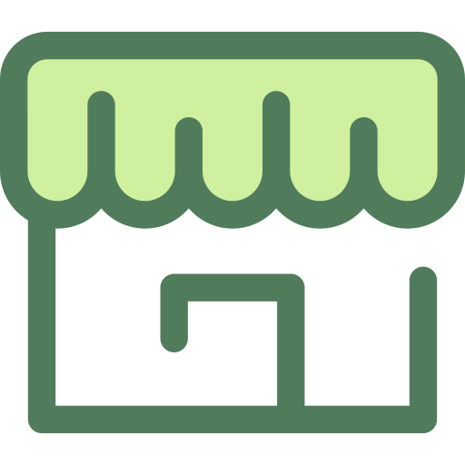

   <h1>Store app</h1>
   

 

## Directories

| directory    |    description     |
| :----------- | :----------------: |
| [nemo](nemo) | nemo is django app |
| [nimo](nimo) | angular workspace  |

## Contributtors: 💯

- Gonzales Agip Omar Alexander
- Montero Lopez Roberto
- León Barboza Elmer Joselito

## Start this project

## Documentation

[docs](https://www.notion.so/Django-aplication-b7dfb11cd7044223b21fc98a433a0218)

## Open Source

This project is not open source yet

## Resources

- [template wepack](https://github.com/fceruti/django-starter-project):
  Usage this for inspiration

- **Write rour custom User:\***
  - [blog](https://testdriven.io/blog/django-custom-user-model/#user-model)
  - [docs](Write rour custom User:)
  - [django-notes](https://github.com/ArchTaqi/django-rest-api/blob/master/docs/00-django-notes.md)

## tools

- [Angular](https://angular.io/)
- [django-rest-frameworks](https://www.django-rest-framework.org/)
- [NGRIO](https://ngrx.io/)
